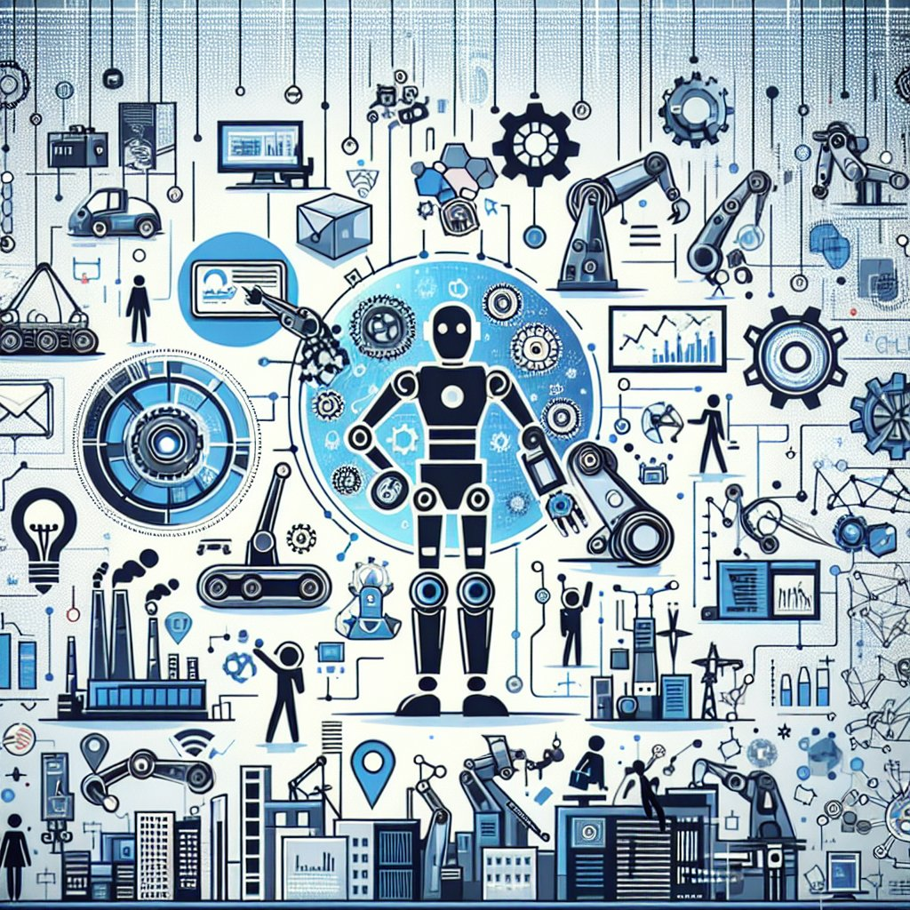

---
description: "探讨南京迪普思科技在RPA领域的应用与发展。"
keywords: "RPA, 南京迪普思科技, 企业微信营销, 聚合聊天"
---
# 南京迪普思科技RPA

## 一、南京迪普思科技简介

南京迪普思科技是一家致力于机器人流程自动化（RPA）领域的领先企业，提供智能化解决方案和技术支持。公司秉承创新精神，不断推动技术发展，为企业提供高效、智能的自动化解决方案。

## 二、RPA技术及应用

RPA技术是一种利用软件机器人或人工智能执行日常任务的自动化技术。南京迪普思科技在RPA领域拥有丰富经验，在金融、制造、医疗等行业广泛应用，极大提升了企业效率和精确度。

## 三、南京迪普思科技RPA解决方案

南京迪普思科技提供的RPA解决方案涵盖流程自动化、数据处理、报表生成等多个领域。其灵活性和可扩展性让企业能够定制化应用，实现高度智能化的业务管理。

## 四、企业微信自动化集成

南京迪普思科技与企业微信合作，推出企业微信自动化集成方案，帮助企业实现内部沟通、审批流程自动化，提升员工工作效率和沟通便捷性。企业微信添加个人微信功能更加便捷。

## 五、使用合规工具保障数据安全

南京迪思科技RPA采用严格的数据安全措施，保障客户数据的隐私和安全。同时，结合合规工具，确保数据合规性，提升企业在数字化转型中的安全性和可信度。

## 六、聚合聊天智能化助手

借助南京迪普思科技的聚合聊天智能化助手，企业可以实现客户服务、信息查询等多种功能，提升用户体验，增强客户黏性，助力企业发展。

文章完。
