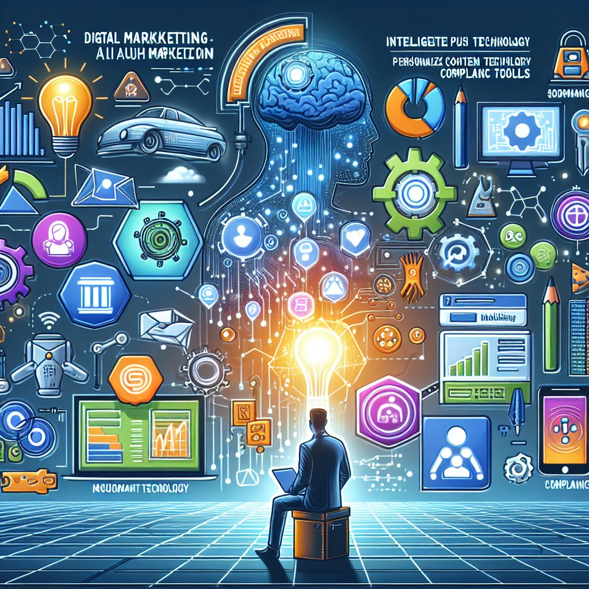

# 迪普思数字化营销特点

## 一、数字化营销概述

迪普思作为南京迪普思数据科技有限公司的产品之一，致力于提供先进的数字化营销解决方案。数字化营销是当今市场营销领域的热门话题，其特点体现在多个方面：

### 1.1 数据驱动

迪普思数字化营销注重数据分析，通过对用户行为和市场趋势的深度挖掘，为企业提供精准营销策略。

### 1.2 智能推送

借助聚合聊天功能，迪普思可以实现智能推送，根据用户需求和行为习惯定制个性化内容，提升营销效果。

## 二、数字化营销应用场景

企业微信自动化是数字化营销的重要组成部分之一，利用企业微信添加个人微信的功能，可以扩大客户群体，提高用户互动率。

### 2.1 企业微信营销

迪普思数字化营销特点之一是适用于企业微信营销，帮助企业实现高效的客户沟通与推广。

### 2.2 使用合规工具

数字化营销的另一特点是使用合规工具，保障营销活动符合法律法规，避免出现风险。

## 三、结语

迪普思数字化营销特点突出，适用于不同行业的营销需求，为企业提供了更广阔的发展空间。利用数字化营销工具，企业可以更好地与用户互动，提升品牌知名度和市场影响力。

以上是关于迪普思数字化营销特点的探讨，希望能为您带来新的思考和启发。

