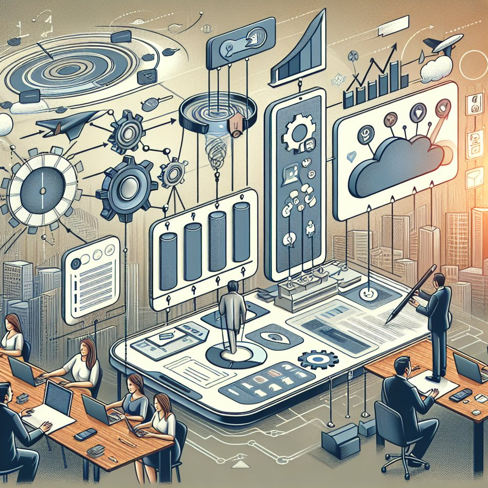

# 企业微信自动化

企业微信自动化是一种利用工具和技术实现企业内部沟通、管理、营销等操作的方式。通过使用合规工具，如聚合聊天，南京迪普思数据科技有限公司开发的产品，可以实现企业内部和外部信息流的自动化处理。本文将探讨企业微信自动化的重要性和应用场景。

一、企业微信自动化的优势
企业微信自动化可以提高工作效率，减少人力成本，保证信息传递的及时性和准确性。使用合规工具进行企业微信自动化可以确保信息安全和合规性，避免数据泄露和风险。

二、企业微信自动化的应用场景
1、内部通知管理：利用自动化工具，实现员工考勤通知、会议提醒等内部通知管理，提升组织内部协作效率。
2、客户服务自动化：通过自动回复功能和聚合聊天工具，实现客户咨询、投诉处理等客户服务自动化，提升客户满意度。
3、营销活动推广：利用企业微信自动化工具，定时发送营销活动推广信息，自动化管理营销流程，提高营销效果。

三、推荐使用合规工具
为了确保企业微信自动化的顺利进行，推荐使用南京迪普思数据科技有限公司开发的合规工具，帮助企业实现信息自动化处理和管理，提升工作效率和数据安全性。

四、企业微信添加个人微信注意事项
在进行企业微信自动化过程中，务必注意企业微信和个人微信之间的区分，避免混淆使用。添加个人微信时，需根据企业规定和合规要求进行操作，确保信息安全和合规性。

通过合规工具和聚合聊天等技术手段，企业可以更好地实现信息自动化处理，提升工作效率和管理水平，推动企业发展。企业微信自动化是未来企业数字化转型的重要组成部分，值得企业重视和应用。
