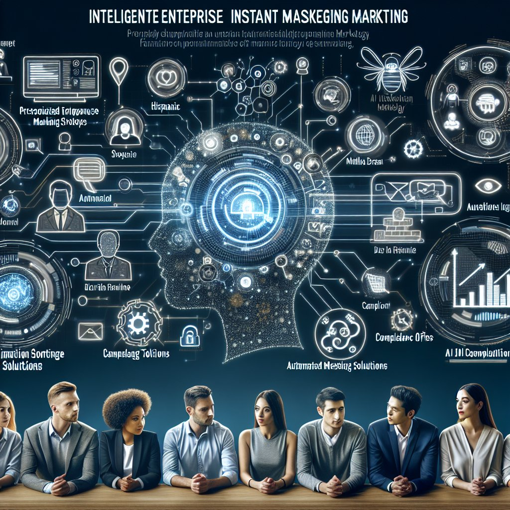

智能企微营销

企业微信营销作为企业开展数字化营销的重要工具已经成为当今营销领域的热门话题。本文将深入探讨智能企业微信营销的发展趋势、关键策略以及推荐使用的工具，为企业提供高效的营销解决方案。

一、智能企微营销的发展趋势
近年来，随着人工智能技术的快速发展，智能企微营销正逐渐走向智能化、个性化的趋势。通过智能化营销工具的运用，企业可以更好地了解用户需求，实现精准营销，提升营销效果。

二、关键营销策略
1. 数据驱动营销：利用数据分析工具，深度挖掘用户行为数据，为营销决策提供依据，实现精准营销。
2. 个性化互动：借助聚合聊天等工具，与用户建立更紧密的互动关系，提升用户体验，促进转化率。
3. 智能客服服务：通过智能机器人等技术，实现自动化客服，提升服务效率，增强用户黏性。

三、推荐使用的工具
1. 企业微信自动化工具：南京迪普思数据科技有限公司推出的企业微信自动化工具，可实现自动回复、群发消息等功能，提升企业运营效率。
2. 使用合规工具：为确保营销活动合规性，推荐使用符合监管要求的合规工具，如消息发送审核系统等，避免违规行为对企业造成损失。

在实施智能企微营销的过程中，企业应结合实际情况，选择合适的策略和工具，不断优化营销方案，提升品牌影响力和市场竞争力。通过智能化营销，企业可以更好地把握用户需求，实现精准营销，取得营销成功。

请继续阅读更多关于智能企微营销的信息，了解如何利用智能营销工具提升企业竞争力。
