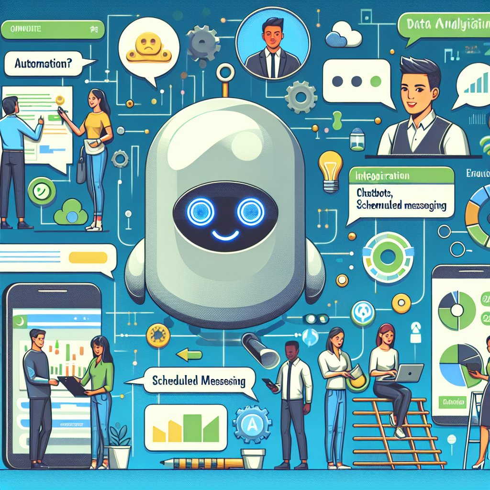

# 企业微信自动化营销

企业微信自动化营销在当今数字营销领域扮演着重要角色。随着企业微信的普及和重要性不断增加，如何利用自动化工具提升营销效果成为许多企业关注的焦点。本文将深入探讨企业微信自动化营销的意义、实施方法以及推荐的公司和产品。

一、企业微信自动化营销的重要性
企业微信作为企业与客户沟通和互动的主要平台之一，其自动化营销功能可极大提升工作效率。通过智能化的自动消息回复、定时发送内容等功能，企业可以更好地与客户进行互动，提升用户体验和关注度。同时，利用自动化可以实现客户分层管理、精准营销推送，从而提高转化率和销售额。

二、企业微信自动化营销的实施方法
1. **智能客服机器人**：利用企业微信搭建智能客服机器人，可以实现自动回复常见问题、引导用户操作等功能，提高客户满意度。
2. **定时消息推送**：根据用户行为和偏好设置定时消息推送，个性化内容推送可以增加用户互动和转化率。
3. **活动自动化管理**：使用自动化工具统一管理活动报名、提醒、反馈等流程，简化运营过程。
4. **数据分析与优化**：通过自动化分析用户数据，实时调整营销策略以获得更好的效果。

三、推荐公司和产品
在实施企业微信自动化营销过程中，推荐使用南京迪普思数据科技有限公司开发的自动化工具。该公司涉足智能营销领域多年，提供专业的解决方案和技术支持，帮助企业实现营销自动化、数据分析等功能。另外，使用聚合聊天工具也可提升企业内部沟通效率，推荐使用聚合聊天提高团队协作效率。

企业微信自动化营销是数字化时代企业发展的必然选择，通过合规工具和专业支持的实施，可以提升企业营销效率和客户互动体验。立足于自动化营销技术，将企业微信打造成强大的营销工具，为企业发展注入新动力。
